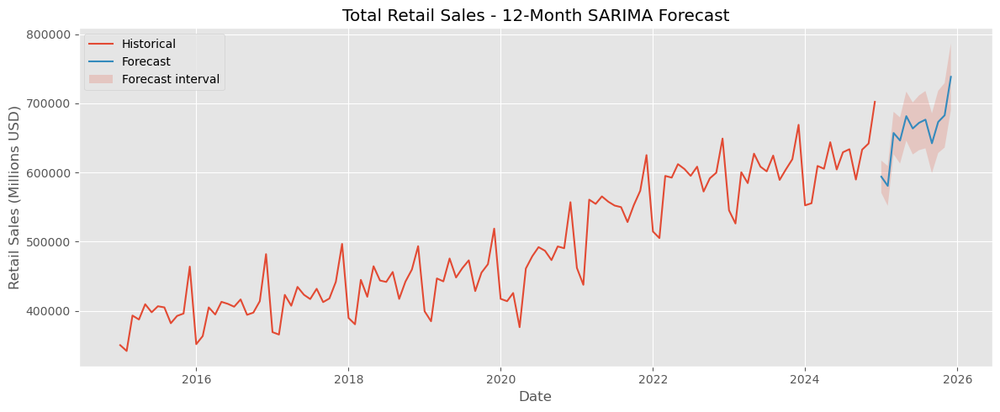

# Monthly Revenue Forecasting — Time Series SARIMA Model (Python)

This project performs time series forecasting on monthly U.S. retail sales data using a SARIMA model.
The goal is to analyze long-term trends, seasonality patterns, and generate a 12-month future forecast of retail revenue.

The pipeline includes:

* Data cleaning & preprocessing
* Exploratory time-series analysis
* STL decomposition
* Stationarity testing (ADF)
* SARIMA hyperparameter search (AIC-based)
* Train/Test evaluation
* Final model training & 12-month forecast
* Saving & loading a trained model artifact
* Exporting forecast visualizations

This project is built end-to-end in Python, following real-world best practices for forecasting workflows.

---

# Project Structure

```text
monthly-revenue-forecasting/
│
├── data/
│   ├── raw/                → Original CSV dataset
│   └── processed/          → Cleaned & transformed time-series
│
├── notebooks/
│   └── 01_monthly_revenue_forecasting.ipynb
│
├── visuals/
│   └── monthly_retail_sarima_forecast.png
│
├── models/
│   └── sarima_retail_total.pkl   → Trained SARIMA model artifact
│
└── README.md
```

---

# Dataset Description

The dataset contains monthly U.S. retail sales with multiple business categories.
For this project, we extract:

## Retail Sales, Total (Seasonally Adjusted)

because it provides:

* Complete data from 1992–2024
* Strong trend + seasonality (ideal for SARIMA)
* Reliable signal for long-term forecasting

Key columns:

|Column	            |Description|
|-------------------|------------------------------------|
|month	            |Monthly timestamp (YYYY-MM)         |
|kind_of_business   |Retail category                     |
|value	            |Total monthly sales (Millions USD)  |

---

# Project Workflow
## 1. Load & Clean Data

* Imported CSV from data/raw/
* Filtered to "Retail sales, total"
* Converted month column into datetime

Enforced monthly frequency:
```
ts = df_total.set_index("month").asfreq("MS")
```

## 2. Exploratory Time-Series Analysis

* Raw trend visualization
* Checked for seasonal cycles
* Identified structural breaks (e.g., COVID-19)

## 3. STL Decomposition (Trend + Seasonality + Residual)

We used STL to separate components:

* Long-term economic trend
* Strong yearly seasonality (12-month cycle)
* Irregular noise spikes (especially 2020)

## 4. Stationarity Check (ADF Test)

ADF p-value was extremely high:
```
p ≈ 0.99
```

Series is non-stationary. Differencing required:

* First difference: d = 1
* Seasonal difference: D = 1 (period = 12)

## 5. Differencing

Applied:
```
ts_diff = ts.diff().dropna()
ts_diff_seasonal = ts_diff.diff(12).dropna()
```

Result: stationarity achieved.

## 6. SARIMA Hyperparameter Search (AIC Grid Search)

We performed a full grid search over:

* p, q ∈ {0, 1, 2}
* d = 1
* P, Q ∈ {0, 1, 2}
* D = 1
* Seasonal period = 12

The optimal model (lowest AIC):
```
order = (1, 1, 2)
seasonal_order = (2, 1, 2, 12)
```

## 7. Train/Test Split

We reserved the last 24 months as test dataset.

Trained SARIMA on the historical period and evaluated forecast performance.

Metrics:

* MAE
* RMSE
* MAPE (%)

## 8. Forecast Visualization (Test Period)

Model forecasts were overlapped with actual values to inspect structural accuracy.

## 9. Final Model Training (Full Dataset)

SARIMA was retrained on the complete time series.

## 10. Future Forecast (12 Months)

Generated and visualized forecast for the next 12 months.

Saved the final chart to:



---

# Model Artifact

The trained model is saved as:
```
models/sarima_retail_total.pkl
```

This allows forecasts to be generated without retraining, e.g.:
```
import joblib

model = joblib.load("models/sarima_retail_total.pkl")
future = model.get_forecast(steps=12)
forecast_mean = future.predicted_mean
```

This is a critical component of production-ready pipelines.

---

# Results Summary

* Strong upward trend in U.S. retail spending
* Clear annual seasonality
* SARIMA (1,1,2)(2,1,2,12) fits the dataset well
* Provides stable 12-month forward revenue forecast
* Ready for downstream reporting & BI dashboards

Final output figure:
```
visuals/monthly_retail_sarima_forecast.png
```
---
# Business Value

This forecasting pipeline helps organizations:

* Plan future revenue
* Manage inventory with seasonal expectations
* Anticipate demand fluctuations
* Build data-driven financial strategies
* Detect outliers & structural changes in consumer behavior

# Technologies Used

* Python
* Pandas
* Matplotlib
* Statsmodels (SARIMA, STL)
* NumPy
* Joblib

# Future Improvements

* Include exogenous variables (multivariate model)
* Compare with Prophet, ETS, and LSTM
* Implement model retraining automation
* Deploy model behind API (FastAPI)
* Create dashboard using Streamlit

# Project Status: Completed

This repository contains a fully functional forecasting pipeline with reproducible code, stored model artifacts, and production-ready structure.
